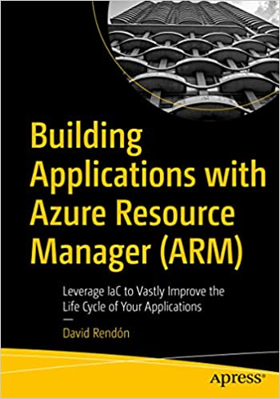
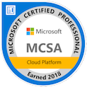
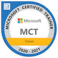
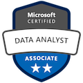
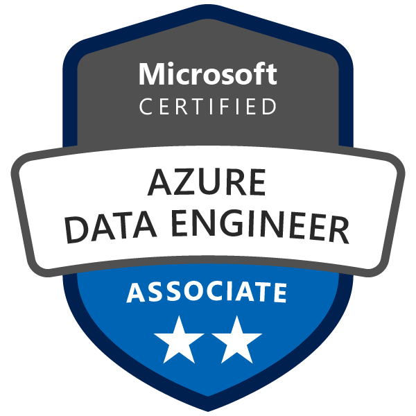
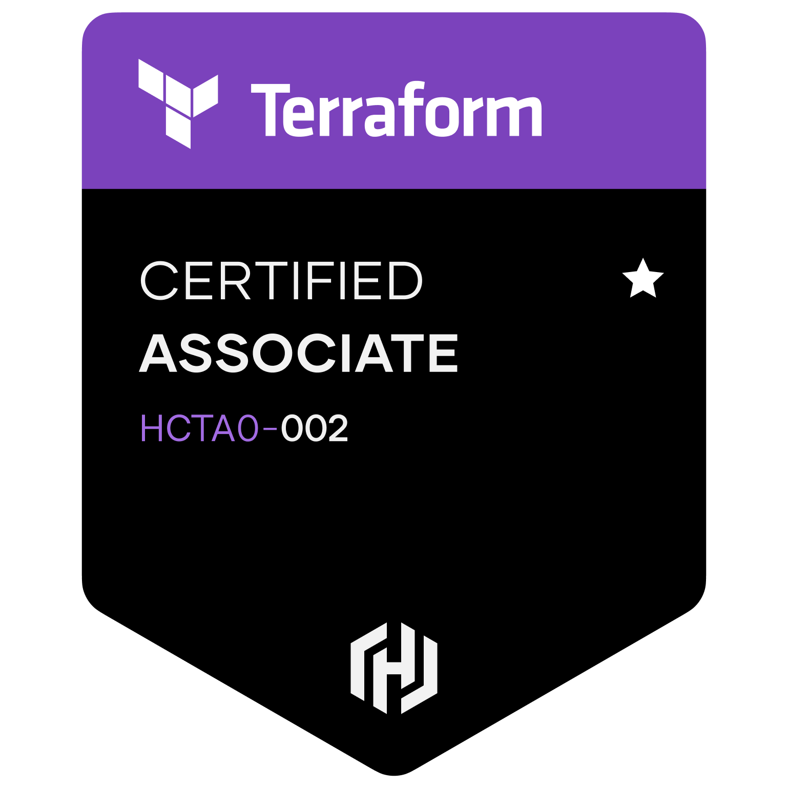
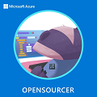
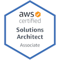
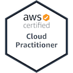
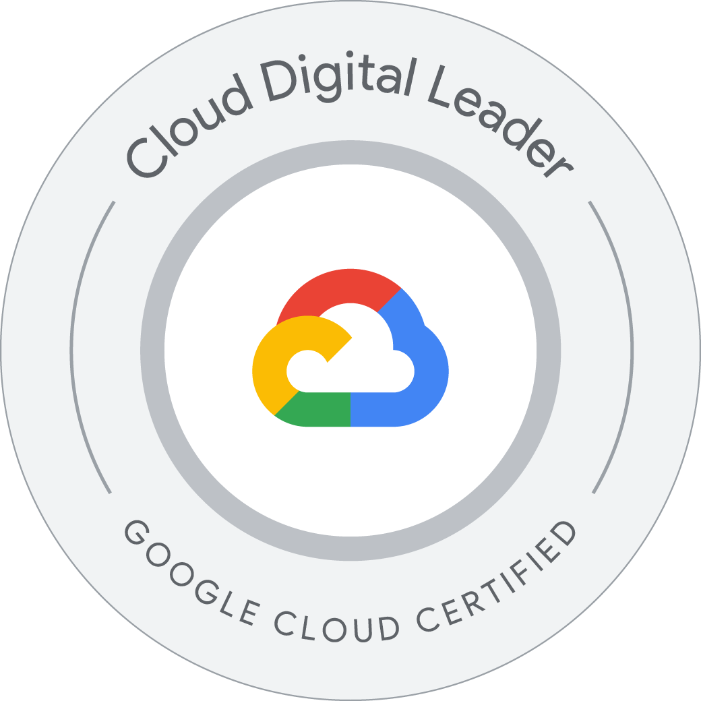

### About Me
I am former Microsoft Azure MVP who currently works for Microsoft as a Senior Cloud Solutions Architect - Engineering. I currently reside in Grand Rapids, MI with my wife and kids. I have wide range in experiences from Systems Analyst, Application and ETL Development, Project Management, Cloud Engineering, DevOps consulting, and Cloud Architecture.

### Blogging
I have a blog at [Blog.JohnFolberth.com](https://blog.johnfolberth.com). Additionally I have had blogs posted and/or featured on:
* [European SharePoint, Office 365 and Azure Conference (ESPC)](https://www.sharepointeurope.com/azure-devops-terraform-task/)
* [Feedspot Top Terraform Blogs](https://blog.feedspot.com/terraform_blogs/)
* [Feedspot Top Azure Blogs](https://rss.feedspot.com/microsoft_azure_rss_feeds/)
* Top Stories from Microsoft DevOps Community
  * [Dynamically Retain Azure DevOps Pipelines](https://devblogs.microsoft.com/devops/top-stories-from-the-microsoft-devops-community-2022-01-04/)
  * [Terraform, Azure DevOps, App Services, and Slots](https://devblogs.microsoft.com/devops/top-stories-from-the-microsoft-devops-community-2021-11-12/)
  * [Azure DevOps Terraform Task](https://devblogs.microsoft.com/devops/top-stories-from-the-microsoft-devops-community-2021-09-10/)
* Microsoft Healthcare and Life Sciences Blog
  * [Tracking Azure History with Azure Resource Graph](https://techcommunity.microsoft.com/t5/healthcare-and-life-sciences/tracking-azure-history-with-azure-resource-graph/ba-p/3611914)
  * [Azure Cosmos DB for PostgreSQL w/React Quickstart - CoAuthor](https://techcommunity.microsoft.com/t5/azure-developer-community-blog/azure-cosmos-db-for-postgresql-w-react-quickstart/ba-p/3666430)
  * [Series of Posts on Azure DevOps YAML Pipelines](https://techcommunity.microsoft.com/t5/healthcare-and-life-sciences/bg-p/HealthcareAndLifeSciencesBlog/label-name/YAML%20Pipeline%20Series)
  * [Series of Post on Azure Data Factory CI/CD](https://techcommunity.microsoft.com/t5/healthcare-and-life-sciences/bg-p/HealthcareAndLifeSciencesBlog/label-name/Azure%20Data%20Factory)

### Interests
* Technology.
* A love hate relationship with running
* Trying to keep up with my kids
* Finding innovative and automated ways to solve technology issues
* Sharing what knowledge I have with others will simultaneously learning from them

### Speaking Engagements
* 2023 Heartland Developer Conference: [Azure Deployment Environments the Future of Development](https://github.com/JFolberth/ToDo_AzureDeploymentEnvironment)
* [West Michigan Azure User Group: Introducing Azure Load Testing to your CI/CD Pipelines](https://youtu.be/KB95CbkgoMk?feature=shared)
* 2022 Heartland Developer Conference: ["Many Flavors of Azure IaC"](https://github.com/JFolberth/Azure_IaC_Flavors)
* 2020 Heartland Developer Conference: ["The DevOps Mindset"](https://blog.johnfolberth.com/hdc-2020-breakout-session-the-devops-mindset/)
* 2019 Heartland Developer Conference: ["Data Analytics in Azure: Our Journey and Experience](https://2019aimhdc.sched.com/event/RZFx/data-analytics-in-azure-our-journey-and-experience)
* [Omaha Azure User Group: YAML Deployment Pipelines](https://blog.johnfolberth.com/yaml-deployment-pipelines/)
* [Omaha Azure User Group: Azure Bicep Walkthrough](https://blog.johnfolberth.com/omaha-azure-user-group-azure-bicep-walkthrough/)

### Publications
Tech Review on "Building Applications with Azure Resource Manager (ARM): Leverage IaC to Vastly Improve the LIfe Cycle of Your Applications"

### Industry Certifications
#### Microsoft

<table style="border-collapse: collapse;">
  <tr>
    <td style="border: none;"></td>
    <td style="border: none;"></td>
    <td style="border: none;"></td>
  </tr>
  <tr>
    <td style="border: none;"></td>
    <td style="border: none;"></td>
    <td style="border: none;"></td>
  </tr>
  <tr>
    <td style="border: none;"></td>
    <td style="border: none;"></td>
    <td style="border: none;"></td>
  </tr>
</table>

#### GitHub and Azure Hero Badgers

<table style="border-collapse: collapse;">
  <tr>
    <td style="border: none;"></td>
    <td style="border: none;"></td>
    <td style="border: none;"></td>
  </tr>
  <tr>
    <td style="border: none;"></td>
  </tr>
</table>

#### AWS and GCP

<table style="border-collapse: collapse;">
  <tr>
    <td style="border: none;"></td>
    <td style="border: none;"></td>
        <td style="border: none;"></td>
  </tr>
</table>

### GitHub Stats

